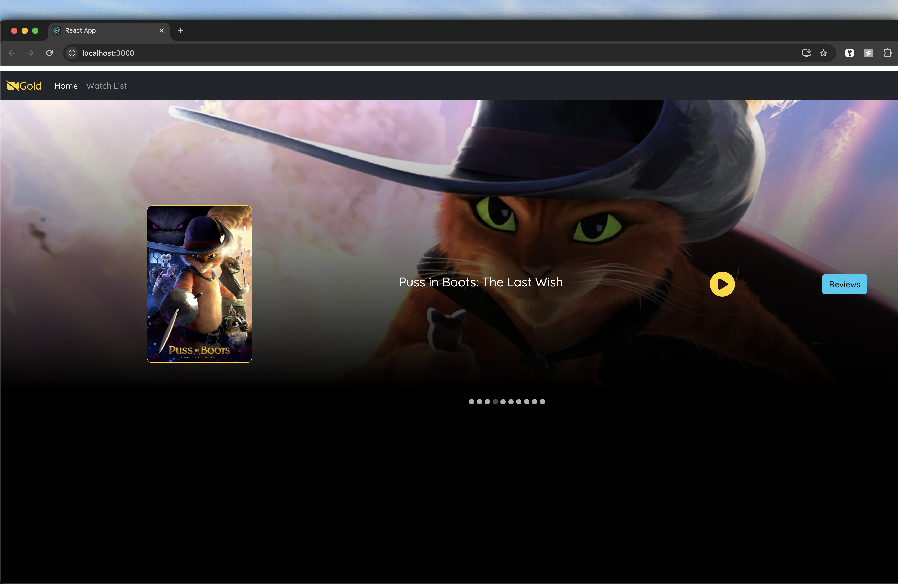

# movies-review

## Overview  
This is a full-stack web application built using **Java Spring Boot** (backend), **React** (frontend), **MongoDB** (database), and **Axios** for HTTP requests. Added features to view the trailer of a movie in a media player, as well as to post reviews.

## Features  
- RESTful API with Java Spring Boot for handling server-side logic  
- Frontend with React for a dynamic, responsive user interface  
- MongoDB for efficient document-oriented data storage  
- Axios for seamless communication between frontend and backend

## Prerequisites

Before you begin, ensure you have met the following requirements:
- Java Development Kit (JDK) installed.
- Node.js and npm installed.
- I used VS Code for React frontend, IntelliJ for Spring Boot backend, but you can use any IDEs of your choice.

## Setup Instructions  

Follow these steps to set up and run the application locally:

1. Clone the repository:

   ```bash
   git clone https://github.com/saurxbh/movies-review.git

2. Spin up the the Spring Boot server after installing backend dependencies.

   ```bash
    mvn install  
    mvn spring-boot:run

3. Navigate to the frontend directory, install frontend dependencies and run the React app locally.

   ```bash
   npm install
   npm start

## Future Improvements

- Add User Management and Authentication
- Containerize the application with Docker

## Execution

- A carousel of movies is displayed in the header section, which contains movie posters, and links to watch the movie trailer and post reviews about the movie.



